<!--
  Futuristic GitHub Profile README for drcodersupreme
  Built with GitHub-safe Markdown, HTML, SVG widgets, and badges.
  GitHub strips custom CSS/JS from README files, so all motion is handled by trusted animated SVG/image services.
-->

<!-- HERO SECTION -->

  

<h3 align="center">AI Developer | Full Stack Developer | Competitive Programmer</h3>

  

  
  
  

<!-- ANIMATED BANNER -->

  

<!-- ABOUT ME SECTION -->
<h2 align="center">About Me</h2>

<table align="center">
  <tr>
    <td>
      <ul>
        <li>Currently working on <b>PT Fitness App</b></li>
        <li>Learning <b>AI + Backend Development</b></li>
        <li>Loves <b>Java, React, DSA, and AI</b></li>
        <li>Builds random projects late at night when ideas refuse to sleep</li>
        <li>Focused on building impactful software that actually helps people</li>
      </ul>
    </td>
  </tr>
</table>

<!-- TECH STACK SECTION -->
<h2 align="center">Tech Stack</h2>

  

  
  
  
  
  

<!-- GITHUB STATS SECTION -->
<h2 align="center">GitHub Stats</h2>

<!--
  github-readme-stats.vercel.app is often paused/rate-limited, so these cards use ghstats.dev.
-->

  
  

  

<!-- CONTRIBUTION SNAKE ANIMATION -->
<h2 align="center">Contribution Snake</h2>

  <picture>
    <source media="(prefers-color-scheme: dark)" srcset="https://raw.githubusercontent.com/drcodersupreme/drcodersupreme/output/github-contribution-grid-snake-dark.svg" />
    <source media="(prefers-color-scheme: light)" srcset="https://raw.githubusercontent.com/drcodersupreme/drcodersupreme/output/github-contribution-grid-snake.svg" />
    
  </picture>

<!-- TROPHIES SECTION -->
<h2 align="center">Trophies</h2>

  

<!-- FEATURED PROJECTS SECTION -->
<h2 align="center">Featured Projects</h2>

<!--
  GitHub README does not allow custom hover CSS, so these are GitHub-safe visual cards.
  Update repository URLs if your actual repository names differ.
-->
<table>
  <tr>
    <td width="50%" valign="top">
      <h3 align="center">PT Fitness App</h3>
      

        AI-assisted fitness planning app for personalized workouts, progress tracking, and smarter training decisions.
      

      

        
        
        
      

      

        
      

    </td>
    <td width="50%" valign="top">
      <h3 align="center">AI Chatbot Project</h3>
      

        Conversational AI experiment focused on natural chat flows, backend APIs, and intelligent response handling.
      

      

        
        
        
      

      

        
      

    </td>
  </tr>
  <tr>
    <td width="50%" valign="top">
      <h3 align="center">DSA Solutions Repository</h3>
      

        Clean competitive programming solutions, Java-first problem solving, patterns, notes, and algorithm practice.
      

      

        
        
        
      

      

        
      

    </td>
    <td width="50%" valign="top">
      <h3 align="center">Portfolio Website</h3>
      

        Modern personal portfolio for projects, skills, developer story, and polished web experiments.
      

      

        
        
        
      

      

        
      

    </td>
  </tr>
</table>

<!-- SOCIAL LINKS SECTION -->
<h2 align="center">Connect With Me</h2>

  
  
  
  

<!-- VISITOR COUNTER -->
<h2 align="center">Visitor Counter</h2>

  

<!-- QUOTE SECTION -->
<h2 align="center">
  
</h2>

<!-- FOOTER -->

  

